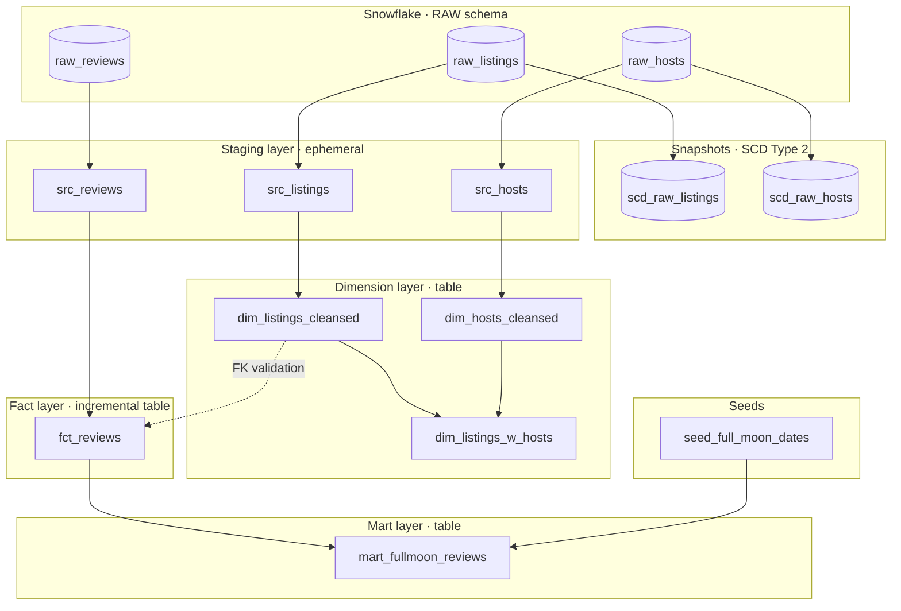

# Airbnb Analytics Pipeline

A dbt project that transforms raw Airbnb operational data into a tested, documented, analytics-ready layer in Snowflake. Covers listings, hosts, and guest reviews — including a mart for lunar sentiment analysis.

---

## Architecture



**Data flow:** Raw sources → (optional) SCD snapshots for history → ephemeral staging for field renaming → cleansed dimensions → incremental fact table → enriched mart.

---

## Project structure

```
airbnb/
├── models/
│   ├── src/                  # Ephemeral staging — field renames only
│   │   ├── src_hosts.sql
│   │   ├── src_listings.sql
│   │   └── src_reviews.sql
│   ├── dim/                  # Cleansed dimension tables
│   │   ├── dim_hosts_cleansed.sql
│   │   ├── dim_listings_cleansed.sql
│   │   └── dim_listings_w_hosts.sql
│   ├── fct/                  # Incremental fact tables
│   │   └── fct_reviews.sql
│   ├── mart/                 # Business-specific enrichments
│   │   └── mart_fullmoon_reviews.sql
│   ├── schema.yml            # All model + column docs and tests
│   ├── sources.yml           # Source definitions, freshness, tests
│   ├── docs.md               # Extended doc blocks
│   └── overview.md           # dbt docs homepage
├── snapshots/                # SCD Type 2 — hosts and listings history
├── seeds/                    # seed_full_moon_dates.csv
├── tests/                    # Custom singular tests
├── macros/                   # Reusable macros
├── packages.yml              # dbt_utils, dbt_expectations
├── dbt_project.yml           # Materializations, tags, grants, hooks
└── profiles.yml              # Snowflake connection (not committed in prod)
```

---

## Prerequisites

| Tool | Version |
|---|---|
| dbt-snowflake | >= 1.8 |
| Python | >= 3.9 |
| Snowflake account | Access to `AIRBNB` database |

---

## Setup

### 1. Clone the repo

```bash
git clone <repo-url>
cd airbnb
```

### 2. Install dbt

```bash
pip install dbt-snowflake
```

### 3. Configure your Snowflake connection

The project uses **private key authentication**. Create or edit `profiles.yml` in the project root (or in `~/.dbt/profiles.yml`):

```yaml
airbnb:
  target: dev
  outputs:
    dev:
      type: snowflake
      account: <your-snowflake-account>   # e.g. xy12345.us-east-1
      user: <your-username>
      role: TRANSFORM
      private_key: <your-private-key>
      private_key_passphrase: <passphrase-if-encrypted>
      database: AIRBNB
      schema: DEV
      warehouse: COMPUTE_WH
      threads: 4
```

> **Password auth alternative** — replace `private_key` / `private_key_passphrase` with `password: <your-password>`.

The pipeline expects two Snowflake roles to exist:
- `TRANSFORM` — used by dbt to read sources and write models
- `reporter` — read-only role granted select on all models for BI tools

### 4. Install dbt packages

```bash
dbt deps
```

This installs:
- [`dbt_utils`](https://github.com/dbt-labs/dbt-utils) `1.3.3` — surrogate keys, test helpers
- [`dbt_expectations`](https://github.com/metaplane/dbt-expectations) `0.10.10` — column-level statistical tests

### 5. Verify the connection

```bash
dbt debug
```

### 6. Load seed data

```bash
dbt seed
```

This loads `seed_full_moon_dates.csv` into Snowflake — required before running `mart_fullmoon_reviews`.

### 7. Run the pipeline

```bash
# Build all models
dbt run

# Run tests
dbt test

# Or build + test in one step
dbt build
```

---

## Running subsets

The project uses tags to allow selective execution:

```bash
# Rebuild only the staging layer
dbt run --select tag:staging

# Test only the dimension layer
dbt test --select tag:dimensions

# Build the full fact and mart layer
dbt build --select tag:facts tag:marts

# Run a single model and all its upstream dependencies
dbt build --select +mart_fullmoon_reviews
```

---

## Snapshots

SCD Type 2 snapshots capture the full history of host and listing changes:

```bash
dbt snapshot
```

This creates/updates `scd_raw_hosts` and `scd_raw_listings` in the `DEV` schema with `dbt_valid_from` / `dbt_valid_to` columns. Run this before or after `dbt run` — snapshots operate independently of the model DAG.

---

## Generating documentation

```bash
# Generate the docs site
dbt docs generate

# Serve locally at http://localhost:8080
dbt docs serve
```

The docs homepage (`overview.md`) describes the business context, data model, and quality strategy in plain language.

---

## Test results

All test failures are stored in the `test_results` schema in Snowflake (`+store_failures: true`). Query them directly to investigate failures:

```sql
SELECT * FROM DEV.test_results.<test_name>
ORDER BY 1;
```

Every model run is also logged to an audit table:

```sql
SELECT * FROM DEV.audit_log ORDER BY run_timestamp DESC;
```

---

## Source freshness

The reviews source is monitored for staleness. Run:

```bash
dbt source freshness
```

| Threshold | Behaviour |
|---|---|
| > 1 hour since last load | Warning |
| > 24 hours since last load | Error |

---

## Key models at a glance

| Model | Layer | Grain | Description |
|---|---|---|---|
| `dim_listings_cleansed` | Dimension | One row per listing | Cleansed listing attributes with numeric price |
| `dim_hosts_cleansed` | Dimension | One row per host | Cleansed host profiles with Anonymous fallback |
| `dim_listings_w_hosts` | Dimension | One row per listing | Listings joined with host context — use this for most analyses |
| `fct_reviews` | Fact | One row per review | All guest reviews, incremental load, surrogate key |
| `mart_fullmoon_reviews` | Mart | One row per review | Reviews enriched with full moon flag for lunar sentiment analysis |
